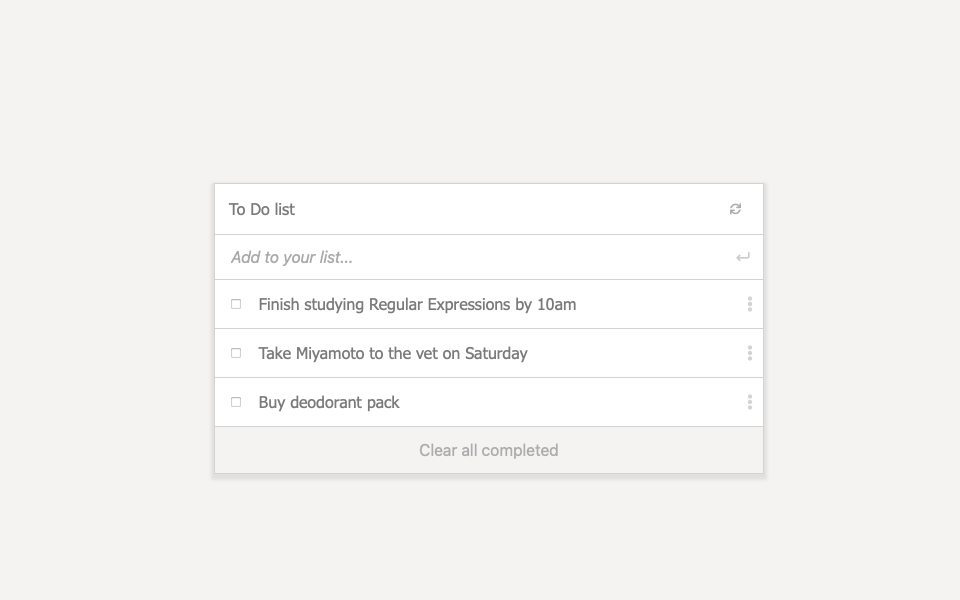

# To Do List app

To-Do list app is an academic project to learn how to use Webpack and ES6 JS standards.

> The app has a minimalist approach. Users can add new tasks and check them off once completed. Users can also move them around through drag-and-drop and edit their content.

I built this project using webpack and Vanilla JS.

Features:
- add a new task
- check completed task
- remove completed tasks from the list
- drag and drop tasks to change their order

## Live Demo

Go here to see a live demo: [https://starsheriff2.github.io/To-Do-list-app/](https://starsheriff2.github.io/To-Do-list-app/)

## Built With

- HTML, CSS, JS
- NPM 7.18.1
- Webpack 5.44.0
- HtmlWebpackPlugin
- webpack-dev-server
- Linters: ESLint, Stylint, WebHint
- VS Code
## Getting Started

To get a local copy up and running, follow these simple example steps.

### Prerequisites
- A browser to open the main file
- Node.js
- NPM
### Setup
1. Open your terminal or command prompt.
2. If you do not have git installed in your system, skip this step and go to step 3; otherwise, go to the directory where you want to copy the project files and clone it by copying this text into your command prompt/terminal: `git@github.com:StarSheriff2/To-Do-list-app.git`.
 Now go to the ***"Install Dependencies"*** section
3. Download the program files by clicking on the green button that says “**Code**” on the upper right side of the project frame.
4. You will see a dropdown menu. Click on “**Download ZIP**.”
5. Go to the directory where you downloaded the **ZIP file** and open it. Extract its contents to any directory you want in your system.

### Install Dependencies
1. Go to the root directory of the project
2. In your command line, while in the root dir, type `npm install`. It will install all necessary dependencies in your project files
3. Now type `npm run start`. It will load the project in your default browser.  
**Note: _This command will not stop on its own. If you change something in your project files, it will recompile and reload the page in your browser. To exit, hit "ctrl + c"_**
### Linters
To run the linters included in this repository, you will need to install them locally. **Note:** You will need node.js for this and npm:
- to install WebHint, run `npm install --save-dev hint@6.x`
- for Stylelint, `npm install --save-dev stylelint@13.x stylelint-scss@3.x stylelint-config-standard@21.x stylelint-csstree-validator@1.x`
- for ESlint, `npm install --save-dev eslint@7.x eslint-config-airbnb-base@14.x eslint-plugin-import@2.x babel-eslint@10.x`

To run the linters, go the root directory of your repository, and copy/paste the following commands in your terminal:
- to check the HTML file, `npx hint .`
- to check the stylesheets, `npx stylelint "**/*.{css,scss}"`
- to check the JS files, `npx eslint .`

### Usage
- You can add new tasks once the app has loaded to your browser
- Enjoy

## Author

👤 **Arturo Alvarez**
- Github: [@StarSheriff2](https://github.com/StarSheriff2)
- Twitter: [@ArturoAlvarezV](https://twitter.com/ArturoAlvarezV)
- Linkedin: [Arturo Alvarez](https://www.linkedin.com/in/arturoalvarezv/)

## 🤝 Contributing

Contributions, issues, and feature requests are welcome!

Feel free to check the [issues page](https://github.com/StarSheriff2/To-Do-list-app/issues).

## Show your support

Give a ⭐️ if you like this project!

## 📝 License

This project is [MIT](https://github.com/StarSheriff2/To-Do-list-app/blob/development/LICENSE) licensed.

